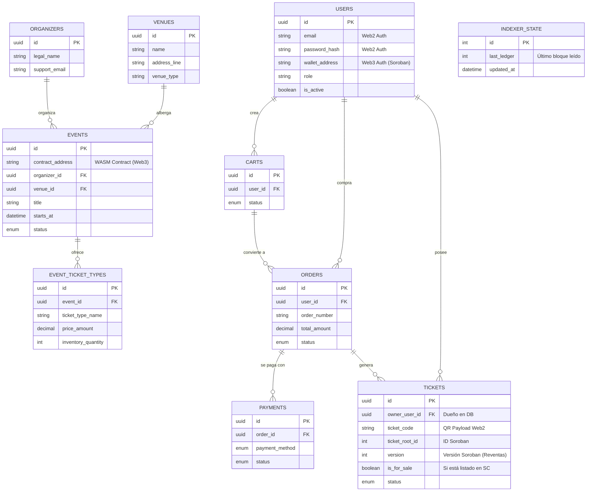

# Modelo de Datos Híbrido (Web2.5)

Este diagrama representa cómo se fusionó la visión tradicional de e-commerce (creada por el equipo Frontend/Backend) con la capa de infraestructura descentralizada de Soroban (Web3).

## Diagrama Entidad-Relación (ER)



## Simbiosis de Modelos: Lo Mejor de Dos Mundos

Hemos integrado ambos enfoques para que la tiquetera funcione exactamente igual a plataformas reales (Tuboleto, Ticketmaster), pero con el superpoder de impedir el fraude en reventa.

### Lo que aportó tu compañero (Web2)
Su diseño era muy robusto para simular el **comercio tradicional**. Él tuvo en cuenta:
1. **Carrito de Compras y Órdenes**: Control de expiración del carrito y flujo transaccional (`orders`, `cart_items`, `seat_holds`).
2. **Inventario Físico Complejo**: Consideró tipos de boleto (`Vip`, `General`), locaciones físicas (`venues`, `cities`), secciones y control de sillas numeradas (`seats`, `venue_sections`).
3. **Plataformas de Pago**: Control exhaustivo del estado de los abonos tradicionales (Tarjeta de crédito, PSE) mediante la tabla `payments`.

### Lo que le faltaba y le inyectamos de nuestra parte (Web3 / Stellar)
Su esquema ignoraba por completo **cómo íbamos a conectar a los usuarios con la blockchain y cómo rastrear la propiedad real del boleto**. Nosotros corregimos y agreamos:
1. **El Vínculo del Wallet (`wallet_address` en `Users`)**: Ahora los usuarios inician sesión y si quieren el boleto web3, pueden vincular su billetera.
2. **El Escudo Antifraude (`ticket_root_id` y `version` en `Tickets`)**: Agregamos las variables que leen directamente del Smart Contract. Así, si el boleto es revendido, la versión aumenta automáticamente en la DB, haciendo inútil el QR viejo (evitamos que el usuario inicial entre con un pantallazo).
3. **Control Descentralizado del Evento (`contract_address` en `Events`)**: Como tenemos la "Factory", cada evento ahora almacena en su fila la dirección única `C...` que se le desplegó en la red de Stellar.
4. **El Sincronizador (`indexer_state`)**: Añadimos el "cerebro" que le dirá a nuestro indexador de Node.js en qué bloque de la red (Ledger) se quedó buscando eventos de nuestros contratos.
```
