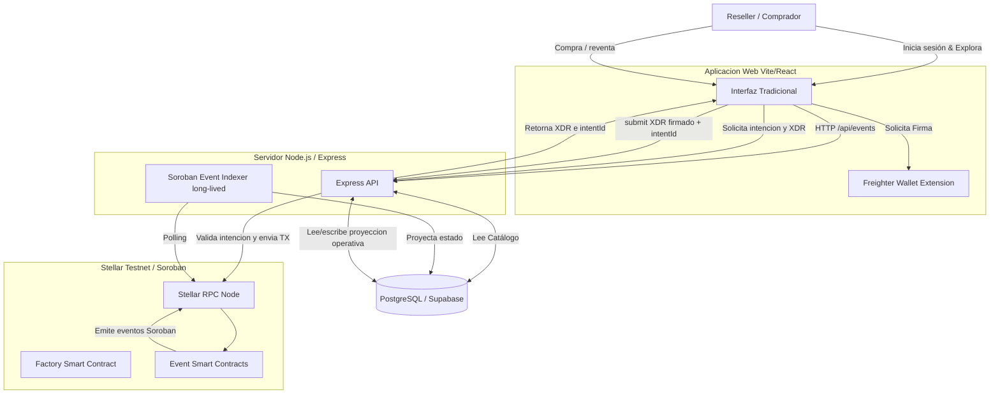

# Arquitectura Hibrida Web2.5 — Stellar Tickets

La plataforma resuelve el problema de reventa especulativa y fraude en boletos digitales fusionando lo mejor de dos mundos: la velocidad y facilidad de Web2, con la trazabilidad y seguridad inmutable de Web3 (Soroban).

## Estado Runtime Actual

El runtime actual es una arquitectura Web2.5, no una dApp pura:

- **Frontend**: Vite + React desplegable en Vercel.
- **Backend**: Node.js + Express desplegado como proceso de larga duracion, principalmente Railway.
- **Base de datos**: PostgreSQL/Supabase en schema `ticketing`.
- **Blockchain**: Stellar Testnet / Soroban para contratos de evento, tickets NFT y eventos on-chain.
- **Indexer**: proceso Node long-lived que sincroniza eventos Soroban hacia PostgreSQL. No debe depender de serverless.
- **Serverless**: el repositorio conserva `backend/api/index.ts` y `backend/vercel.json` como configuracion heredada/alternativa, pero serverless no es el despliegue principal del backend porque no sostiene procesos de fondo.

## Diagrama de Componentes

## Separación de Responsabilidades

### 1. Frontend (La Cara de la Tiquetera)
Actúa como cualquier e-commerce moderno. Los usuarios tienen perfiles, contraseñas y ven el catálogo de eventos.
El checkout oficial del prototipo usa **pago simulado** y genera ordenes/tickets en PostgreSQL. Las operaciones Web3 visibles en demo, como asegurar/listar/comprar reventa cuando aplica, construyen XDR y solicitan firma con Freighter.

### 2. Backend (El Habilitador)
Su API expone endpoints tradicionales para consumo del frontend, administra autenticacion JWT, carrito, checkout simulado, scanner, intenciones de transaccion y despliegues administrativos.
Para operaciones de usuario, el backend genera una intencion y un `XDR`; luego valida que el `XDR` firmado coincida con la intencion antes de enviarlo a Soroban. Algunas operaciones administrativas usan `ORGANIZER_SECRET` como llave custodial del backend; esta frontera se documenta como limitacion controlada de la demo Web2.5.

### 3. Base de Datos (El Espejo Rápido)
Almacena descripciones largas, imágenes de recintos, fechas y cuentas de usuario.
La base de datos es una **proyeccion operativa/cache** del estado relevante para la experiencia web: eventos, tickets, versiones, carrito, ordenes, checkins e historial indexado. Esto evita consultar Stellar RPC por cada pantalla y permite scanner/checkout con baja latencia.

### 4. Smart Contracts (La Fuente de Verdad)
Albergan la lógica crítica:
- **Atómica**: Se asegura que al revender un boleto, el pago en USDC y el cambio de propiedad ocurran simultáneamente.
- **Transparente**: El contrato cobra y transfiere la comisión de reventa al instante al organizador del evento original.
- **Inmutable**: Destruye la versión anterior del boleto y genera una nueva (`burn/remint`), garantizando que los códigos QR antiguos queden totalmente invalidados.

### 5. Indexador (El Sincronizador)
Un proceso en segundo plano en Node.js que pregunta intermitentemente al nodo RPC de Soroban: "Hay nuevos eventos?".
Si el contrato emite `BoletoCreado`, `BoletoRevendido` o `BoletoRedimido`, el indexador captura esa información y actualiza la Base de Datos para que el Frontend y los Verificadores de puerta tengan el estado vigente sin demoras.

El indexador guarda eventos procesados en `onchain_events` y conserva cursor en `indexer_state`. Debe correr en un proceso long-lived, como Railway/local, no como funcion serverless efimera.
