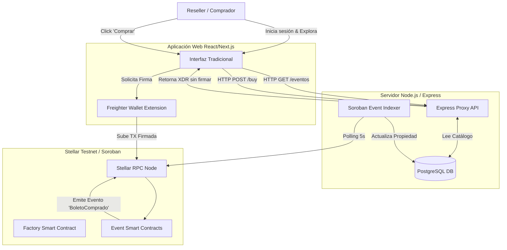

# Arquitectura Híbrida Web2.5 — Stellar Tickets

La plataforma resuelve el problema de reventa especulativa y fraude en boletos digitales fusionando lo mejor de dos mundos: la velocidad y facilidad de Web2, con la trazabilidad y seguridad inmutable de Web3 (Soroban).

## Diagrama de Componentes



## Separación de Responsabilidades

### 1. Frontend (La Cara de la Tiquetera)
Actúa como cualquier e-commerce moderno. Los usuarios tienen perfiles, contraseñas y ven el catálogo de eventos.
La principal diferencia radica en el **Checkout**. El carrito complejo se reemplaza por una solicitud de firma de transacción a la extensión de la wallet del usuario, enviando los dólares digitales (USDC) directamente a la blockchain.

### 2. Backend (El Habilitador)
**Nunca toca llaves privadas**. Su API expone endpoints tradicionales para consumo del Frontend.
Cuando un usuario desea interactuar con la blockchain (por ejemplo, para comprar o enlistar un boleto), el backend ensambla una transacción en bruto (`XDR`) definiendo el contrato inteligente a invocar, los parámetros y las comisiones, y devuelve este ensamblado al Frontend para que el usuario lo firme.

### 3. Base de Datos (El Espejo Rápido)
Almacena descripciones largas, imágenes de recintos, fechas y cuentas de usuario.
La tabla de `Tickets` en la base de datos es un **espejo (caché)** del estado real en la blockchain. Esto evita que la aplicación tenga que consultar a un nodo de Stellar por cada boleto cargado en pantalla, manteniendo la experiencia sub-segundo.

### 4. Smart Contracts (La Fuente de Verdad)
Albergan la lógica crítica:
- **Atómica**: Se asegura que al revender un boleto, el pago en USDC y el cambio de propiedad ocurran simultáneamente.
- **Transparente**: El contrato cobra y transfiere la comisión de reventa al instante al organizador del evento original.
- **Inmutable**: Destruye la versión anterior del boleto y genera una nueva (`burn/remint`), garantizando que los códigos QR antiguos queden totalmente invalidados.

### 5. Indexador (El Sincronizador)
Un proceso en segundo plano (daemon) en el entorno de Node.js que pregunta intermitentemente al nodo RPC de Soroban: "¿Hay nuevos eventos?".
Si el contrato emite `BoletoCreado`, `BoletoRevendido` o `BoletoRedimido`, el indexador captura esa información y actualiza la Base de Datos para que el Frontend y los Verificadores de puerta tengan el estado vigente sin demoras.
```
